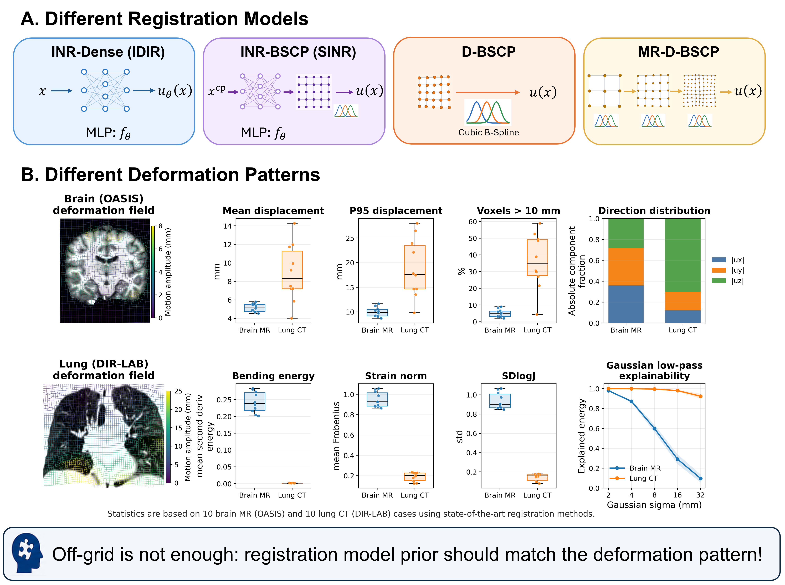
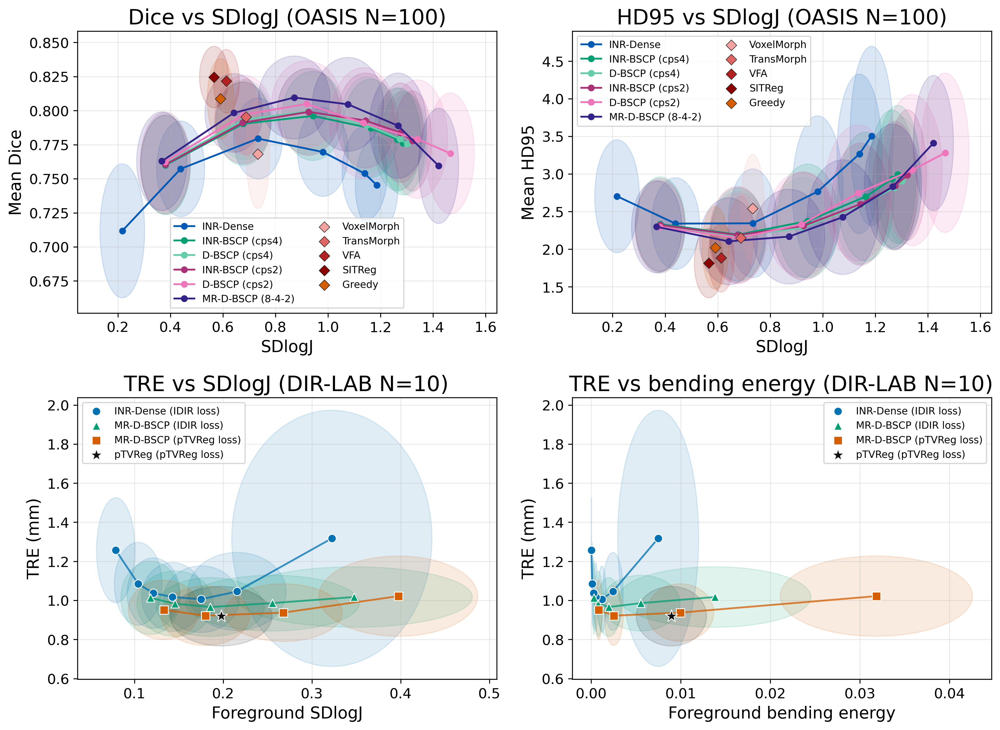

# RightPriorDIR

**The Right Prior for the Right Deformation: Rethinking Continuous Deformable Image Registration**

MICCAI 2026 Off-Grid Workshop — Oral

[Paper](https://papers.miccai.org/miccai-2026-sat/paper/Off_Grid_030.pdf) · [OpenReview](https://openreview.net/forum?id=BNNJcVHtpH) · [Poster](poster/offgrid_poster_v3.pdf) · [Running instructions](docs/running.md)



We study how deformation parameterization, spline structure and optimization
schedule affect deformable registration. This repository provides D-BSCP and
MR-D-BSCP, study wrappers around pinned IDIR/SINR/Dual-INR sources, and frozen
numerical inputs for paper figures and tables.



## Layer 1 — Reproduce the figures and tables

No scans, GPU, registration optimization, or internet at rendering time are
required. Docker build needs network access on first use.

```bash
git clone --recurse-submodules https://github.com/HengjieLiu/RightPriorDIR.git
cd RightPriorDIR
docker build -t rightpriordir:release .
mkdir -p outputs
docker run --rm --network none --user "$(id -u):$(id -g)" \
  -v "$PWD/outputs:/outputs" rightpriordir:release \
  python -m rightpriordir frozen --out /outputs/paper
```

This writes Figure 2 (PNG/PDF), updated OASIS timing, separate historical
OASIS100 accuracy, original Table 1, COPD extension tables and input checksums.
The regenerated Figure 2 PNG matched the paper asset byte-for-byte in release
acceptance. Figure 1 and the poster are static supplied assets.

## Layer 2 — Rerun the experiments

Full cohort/sweep runners are provided for **OASIS, DIR-LAB 4DCT and COPD**,
including per-case evaluation, verified resume, preserved failed attempts and
new-result tables/curves. OASIS base/fast quality and paired cold/warm timing are
separate suites. See the [complete experiment guide](docs/experiments.md).

Inside the data-mounted container, preview a suite without training:

```bash
python -m rightpriordir experiment --suite oasis-paper \
  --data-root /data/oasis --out /work/reruns/oasis-paper
```

Add `--execute` only when you choose to launch the full experiment. Use
`--suite 4dct-paper` or `copd-extension` with their versioned preparation roots.
Afterward, aggregate new tables and curves:

```bash
python -m rightpriordir summarize --run-root /work/reruns/oasis-paper \
  --out /work/reports/oasis-paper
```

New results
remain separate from the frozen paper record. These real optimizations were
**not run during release preparation**.

## Scope and important distinctions

- Paper Figure 2 remains frozen. Base own-method configurations use 2500 steps;
  lung Dual-INR PL1A is an explicitly documented 3000-step author-blur exception.
- The updated main timing table uses September 16, 2026 OASIS first10 paired
  base/fast measurements. Historical OASIS100 accuracy is shown separately,
  **not** presented as accuracy measured in that timing experiment.
- COPD is a post-paper extension. Historical COPD runs use legacy crop bounds;
  4DCT uses corrected bounds. Corrected COPD preparation is separately versioned
  and has no frozen results here. Lung acceleration is pending.
- External DL/Greedy/pTVReg reference dots have frozen numbers and provenance,
  not their training/inference environments. Diagnostic experiments and their
  reproduction code are deferred.

For your own runs, see [data setup](docs/data.md), [methods/configurations](docs/methods.md)
and [detailed commands](docs/running.md). Registration is explicitly opt-in via
`--execute`; preparing this release did not rerun paper optimization. See
[frozen-result provenance](docs/results.md) and [acceptance limits](docs/validation.md).

## Acknowledgement

Our alignment–regularity evaluation is inspired by the ARC paper,
[Evaluation of Deformable Image Registration under Alignment-Regularity Trade-off](https://arxiv.org/abs/2503.07185).

We thank the authors of the following repositories for making their code
publicly available and supporting our baseline implementations:

- [IDIR](https://github.com/MIAGroupUT/IDIR)
- [SINR](https://github.com/vasl12/SINR)
- [Dual-INR](https://github.com/IPMI-ICNS-UKE/DUAL-INR-DIR)

See [third-party notes](THIRD_PARTY.md) for pinned versions, wrapper adaptations
and applicable terms.

## Citation and license

```bibtex
@article{liu2026rightprior,
  title={The Right Prior for the Right Deformation: Rethinking Continuous Deformable Image Registration},
  author={Liu, Hengjie and Shen, Chushu and Ruan, Dan and Sheng, Ke},
  journal={arXiv preprint arXiv:2608.16146},
  year={2026}
}
```

Our code is [MIT licensed](LICENSE). Third-party code, weights, datasets and
container components retain their own terms; see [third-party notes](THIRD_PARTY.md).
Please also cite the original methods you use. This is research software, not
a clinically validated system.

Release candidate: SINR author permission is pending. Public release of this
candidate and distribution of its Docker image are on hold; see
[third-party notes](THIRD_PARTY.md). Technical verification does not resolve
this permission status.
